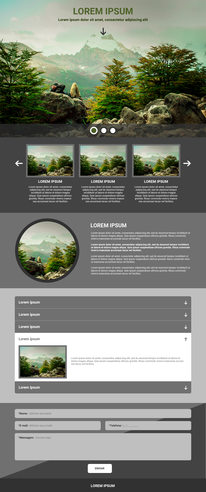

# Projeto teste para vaga de front end na Dot Digital Group

### Nesse projeto vou construir uma interface interativa, com carrouseis em JS puro!

Estou utilizando para esse projeto

<ul>
    <li>React</li>
    <li>SCSS</li>
    <li>React-slick</li>
    <li>Formik</li>
    <li>Yup</li>
    <li>React-testing-library</li>
</ul>

### Para fazer o build do projeto utilizar o comando

**yarn build**

### Caso queira acessar o projeto em ambiente de desenvolvimento
**yarn start**

## Imagem do projeto

